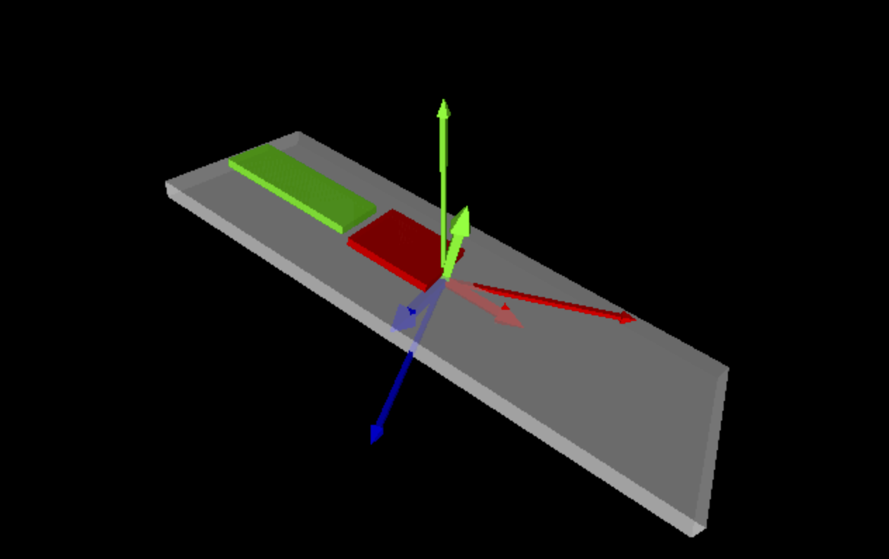
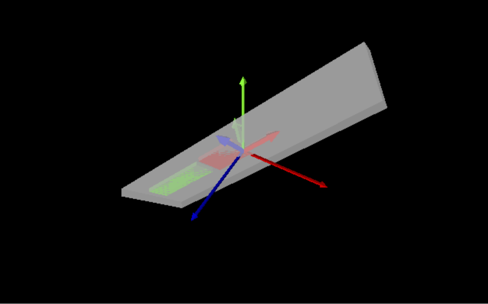

# vpython_imu_tracker
Displays IMU data with VPython to show IMU orientation with updates at 200 Hz. 

The imU_animate.py creates Breadboard representation to match IRL to show motion and oreientation.
Breadboard in translucent white, with Raspberry Pi Pico mounted on top of board in Green and BNO086 in Red. 
In addition, short/thick  arrows showing the breadboard's orientation.

Longer thick arrows show the static World axes: Red in X, Green in Y, Blue in Z, RGB in RHS (X, Y, Z). 
Vpython display shows X as left & right, Y as top & bottom, and Z as In & out.

 

This code uses an IMU's quaternion output(r, i, j, k) at 200 fps (update 5ms).
This repo also contains quaternion_output.py that can be run using Micropython on a conroller accessing a BNO08x sensor.
It uses my bno08x library (I2C, SPI, UART) to efficiently read IMU data.
https://github.com/bradcar/bno08x_i2c_spi_MicroPython

Quaternions uniquely represent every rotation in 3D space. 
Because of this, quaternions are used in computer game implmentations. 
This Vpython code is completely implemented using quaternions.

The reason we don't use Euler Angles is that have issues with Gimbal Lock.
With Euler angle implementations, some orientations have multiple valid representations.
Quaternions avoid this by providing a unique representation for every possible orientation.
https://en.wikipedia.org/wiki/Gimbal_lock

Credits:
Inspired by Paul McWhorter's instruction videos
9-Axis IMU LESSON 21: Visualizing 3D Rotations in Vpython using Quaternions
https://www.youtube.com/watch?v=S77r-P6YxAU

## Loop timing

200 Hz printing of Quaternions over USB-C with 230,400 buadrate (bps) which should have ~ 50% headroom.
Time to read 30 chars 
    
- data comes at 68,000 buadrate/bps = 6,800 * 10bit, 
  - assuming (8 bits data & 2 bits for start & stop)
  - 6,800 = 34 chars /0.005 sec (5 ms)
  - up to 34 chars for 4 Quaternions & 2 bytes for "\r\n"
  - Each Quaterion up to 8 chars: pos numbers "0.6643," and negative "-0.0003,"

Earlier code had 100 Hz sensor updates (Quaternions) over USB-C with 115,200 buadrate (bps) which had ~ 50% headroom.

## Euler Angles, Gimbal Lock, and Quaternions

Rortations can be represented with three angles (rotation in x, y, and z).
This representation is called Euler angles. 
Euler angles suffer from a well-known issue called Gimbal Lock.
Gimbal lock occurs when two rotation axes align, which removes one degree of freedom. When a degree of freedom is
lost, some orientations will have multiple valid representations.
A well-known example occurred during the Apollo 11 mission.
Quaternions avoid this by providing a unique representation for every possible orientation.
Quaternions represents rotation with multiple "single axis and rotation angles".
Most computer games use this implementation for smooth and predictable graphics.

- https://base.movella.com/s/article/Understanding-Gimbal-Lock-and-how-to-prevent-it?language=en_US
- https://en.wikipedia.org/wiki/Gimbal_lock
- https://en.wikipedia.org/wiki/Quaternions_and_spatial_rotation
- https://www.youtube.com/watch?v=zjMuIxRvygQ

## Vpython Conventions:
Default Axes in Vpython
 - X axis → X+ right screen, X- left screen
 - Y axis → Y+ up screen, Y- down screen
 - Z axis → Z+ toward camera (out) and Z- away from camera (in)

       +Y
       |  -Z
       | /
       o------ +X
    
Vpython uses Positive rotation Right-Hand Rule about each axis:
 - Around +X: Y moves toward Z. 
 - Around +Y: Z moves toward X.
 - Around +Z: X moves toward Y.

A quaternion rotation rotates a vector using standard 3D right-handed rotations.:
    v_rot = q * v * q_conjugate

Where:
 - v is treated as a pure quaternion (0, vx, vy, vz)
 - q must be unit-normalized 
 - q_conjugate = (r, -i, -j, -k)

 In practice, VPython-style helper math often uses the Rodrigues' rotation formula optimized vector form:

    v_rot = v + 2 * cross(q_vec, cross(q_vec, v) + q_r * v)
